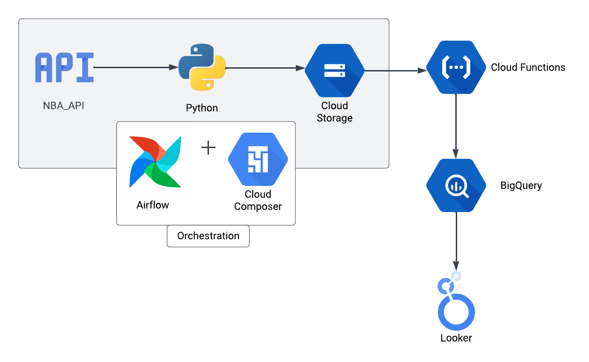
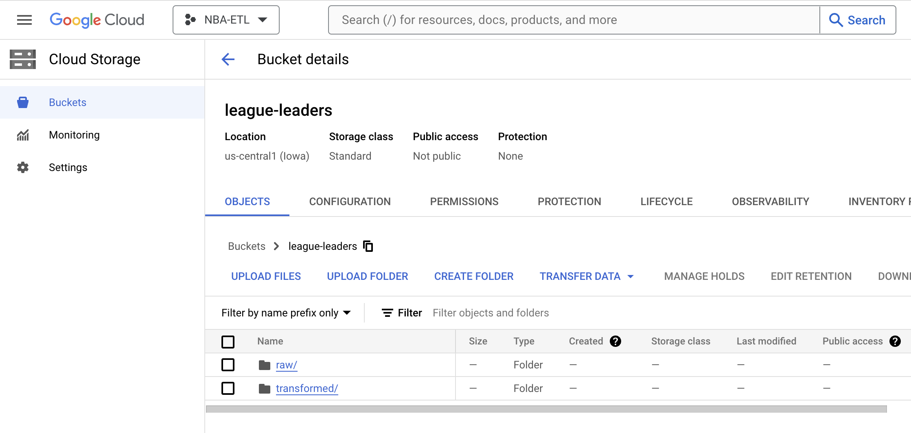
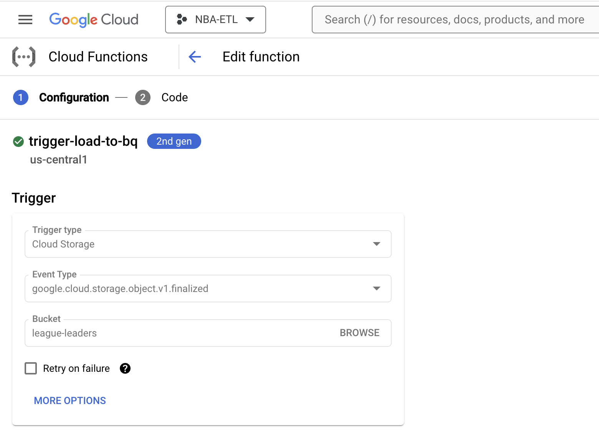
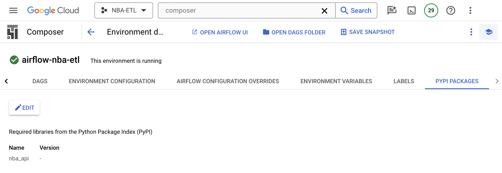
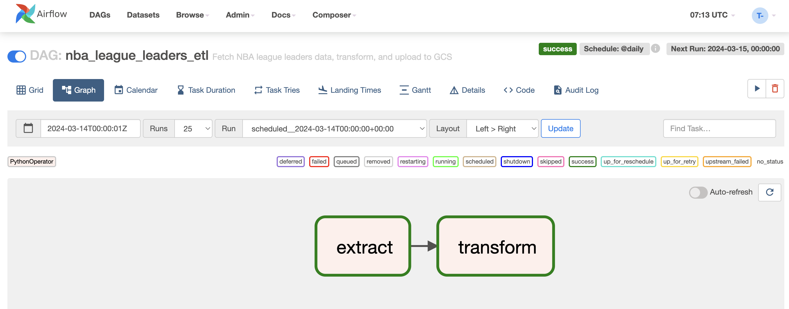

# NBA_Repository

This project is designed to automate the extraction, transformation, and loading (ETL) process for NBA player performance data. By harnessing the `nba_api` Python package, this pipeline updates daily, offering insights into the movements and rankings of the top 500 NBA players.

## Project Overview

This project starts with the retrieval of data using the Python `nba_api`, followed by staging, transformation and storage phases, and culminating in the analysis and visualization of player performance. The whole flow is orchestrated to run at regular daily intervals.

### Architecture

### Data Source & Retrieval

The initial step involves fetching NBA player data through the `nba_api` Python package, specifcally the `leagueleaders` API endpoint, ensuring we have accurate and up-to-date information. We fetch only the top 500 players based on the total number of points in the regular NBA season 2023-2024.

### Data Staging in GCS

After retrieval, the staging data is stored in the form of a CSV file in Google Cloud Storage (GCS), where it undergoes transformation, including the addition of timestamp information to provide context for each data point. 

### Data Processing and Loading into Biquery

Transformed data is then moved to Google BigQuery using Cloud Functions, which are triggered when new data arrives in the GCS bucket. The schema is auto-detected from the CSV File. New data is appended to the BigQuery table.

### Data Orchestration

The process is orchestrated using two Airflow DAGs: one for data retrieval and another for its transformation and storage. The nba_api PyPI package needs to be installed in the Cloud Composer as shown below:

The 2 DAGs will look like this:

### Data Analysis

Once in BigQuery, SQL Common Table Expressions (CTEs) are used to analyze the data, focusing on daily player rank changes. This analysis is saved as a view.

### Visualization

The analysis results are visualized using a dynamic Looker Studio dashboard, providing clear insights into player performance trends and movements.

You can view the dashboard [here](https://lookerstudio.google.com/u/0/reporting/88255fc4-bc28-4f54-8b62-0f74dfb6fe04/page/kKrB).
